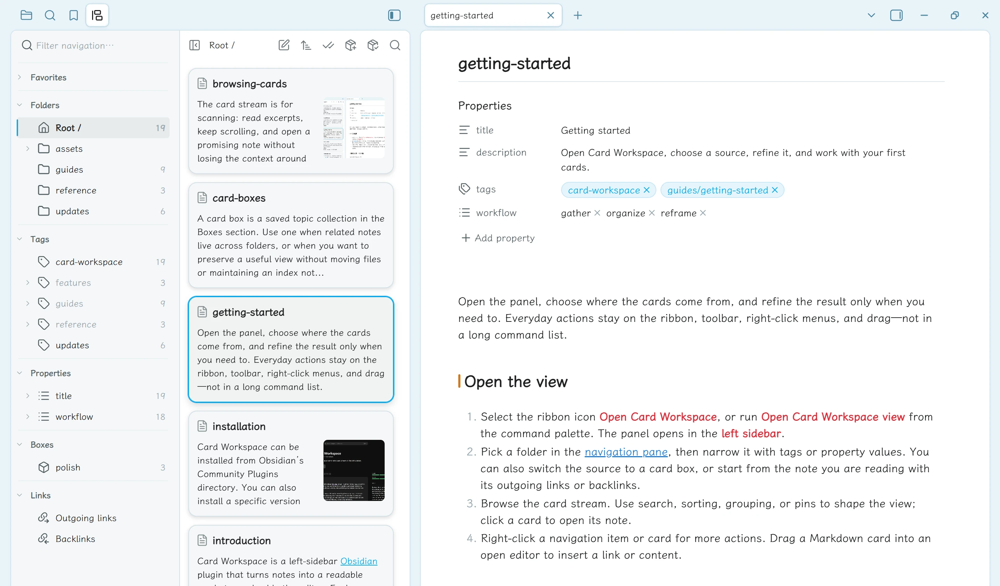
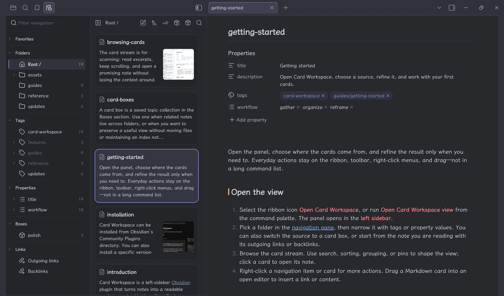

Open the panel, choose where the cards come from, and refine the result only when you need to. Everyday actions stay on the ribbon, toolbar, right-click menus, and drag—not in a long command list.

## Open the view

1. Select the ribbon icon **Open Card Workspace**, or run **Open Card Workspace view** from the command palette. The panel opens in the **left sidebar**.
2. Pick a folder in the [navigation pane](./navigation.md), then narrow it with tags or property values. You can also switch the source to a card box, or start from the note you are reading with its outgoing links or backlinks.
3. Browse the card stream. Use search, sorting, grouping, or pins to shape the view; click a card to open its note.
4. Right-click a navigation item or card for more actions. Drag a Markdown card into an open editor to insert a link or content.

<figure class="cw-doc-shot" id="screenshot-workspace-overview">

<figcaption>Card Workspace stays beside the editor: select a folder, browse its cards, and open a note without leaving the stream.</figcaption>
</figure>

## A useful first pass

Try one path through each part of the workflow:

- **Gather:** open a project folder, enable `workflow` under [Property filters](./property-filters.md), and select a value.
- **Organize:** choose **Sort & group**, then save a useful folder view as a [card box](./card-boxes.md).
- **Reframe:** open a note and compare its [outgoing links and backlinks](./linked-notes.md).

The documentation itself includes a few tags, properties, and Markdown links, so it can serve as a small demonstration vault in Obsidian.

## Reopen after startup

Card Workspace restores the last **folder** you browsed. If it was the vault root, it restores the whole vault. It does not reopen the last card box or linked-note source.

For the details behind the stream, continue with [Browsing cards](./browsing-cards.md) or [Writing and organizing](./writing-and-organizing.md).
