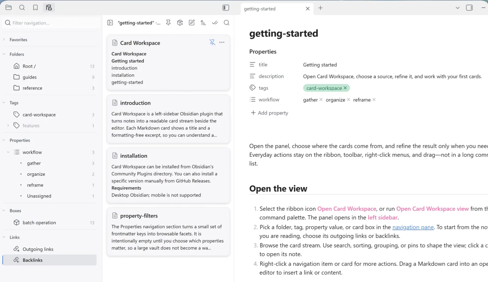

The **Links** navigation section turns Obsidian’s resolved note graph into two card sources: **Outgoing links** and **Backlinks**. It lets you move through a note’s context without leaving the card stream.

## Open a linked-note source

Open a supported note in the editor, then choose:

- **Outgoing links** — supported notes referenced by the source note
- **Backlinks** — supported notes that reference the source note

The source note itself is not included. If no supported note is active, both entries are disabled. Empty results show **No linked notes**.

Standard Markdown links and Obsidian Wikilinks both contribute to Obsidian’s resolved graph. This documentation uses relative Markdown links, so opening it as a vault provides a small working example: this page links to [Navigation](./navigation.md), while Navigation receives the backlink.

## Follow or pin the source note

Linked-note sources follow the active editor note by default while keeping their direction. Switch from one note to another and the card stream reloads its outgoing links or backlinks.

Use **Pin to this note** in the toolbar to hold the source on the current note while you open other cards. Choose **Resume following the active note** to reconnect it to the editor.

## Refine and arrange linked cards

Search, [property filters](./property-filters.md), sorting, grouping, and pins remain available. The browse tag filter and include-subfolders control do not apply because the source comes from links rather than a folder.

Linked-note sources use the global sort, grouping, and pinned paths shared with folder browsing. They are temporary: Card Workspace restores the last folder, not a linked-note source, on startup.

## Save a snapshot as a card box

Choose **Save as card box…** in the toolbar to copy the currently visible linked cards into a new [card box](./card-boxes.md). Search and property filters therefore affect what enters the snapshot.

The saved notes are manually added members. The box is a fixed snapshot, not a live backlinks or outgoing-links rule; later graph changes do not change its membership automatically.
