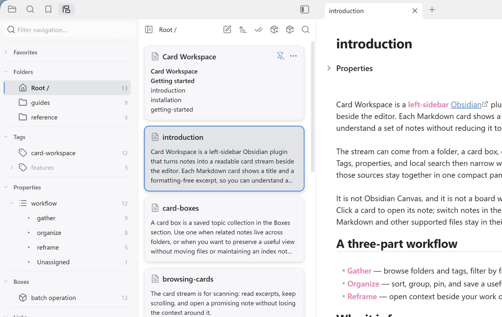

The **Properties** navigation section turns a small set of frontmatter keys into browsable facets. It is intentionally empty until you choose which properties matter, so a large vault does not become a wall of metadata.

## Choose visible properties

Right-click the **Properties** header and choose **Choose visible properties**. Search the vault-wide list, enable the keys you want, and select **Done**. Newly enabled keys open immediately to show the values found in the current card source.

The documentation vault includes a small `workflow` property with the values `gather`, `organize`, and `reframe`, which makes a useful first example after [Getting started](./getting-started.md).

## Filter by values

Click a value to make it the only active property filter. Click it again when it is the sole active value to clear the filter. Ctrl-click on Windows/Linux, Cmd-click on macOS, or press Space to add or remove values without replacing the rest.

- Values inside one property use **OR**: `workflow = gather OR organize`.
- Different properties use **AND**: `workflow = gather AND status = active`.
- **Unassigned** matches notes without a supported value for that key.

Text, finite numbers, booleans, and arrays containing those scalar values are supported. Keys come only from top-level Markdown frontmatter; nested objects are not expanded into dotted properties. Non-Markdown cards have no property values and therefore match only an active **Unassigned** choice.

## Counts and navigation search

Property facets are calculated from the unfiltered source, so choosing one value does not erase its siblings. Turn on navigation counts in [Settings](../reference/settings.md) to show how many source cards contribute to each key and value.

**Filter navigation…** matches both enabled property names and their displayed values. A matching value temporarily expands its property, making it useful in a longer property list.

## Availability by source

Property filters work for folder sources and [linked-note sources](./linked-notes.md). They are unavailable while a card box is open because property clauses already participate in the box’s membership rules.

When you save or add a folder view to a [card box](./card-boxes.md), its active property clauses become part of the new rule together with the folder and tags.

Right-click the Properties header to clear all property filters. Hiding a property also removes its expansion state and any active clause for that key.
